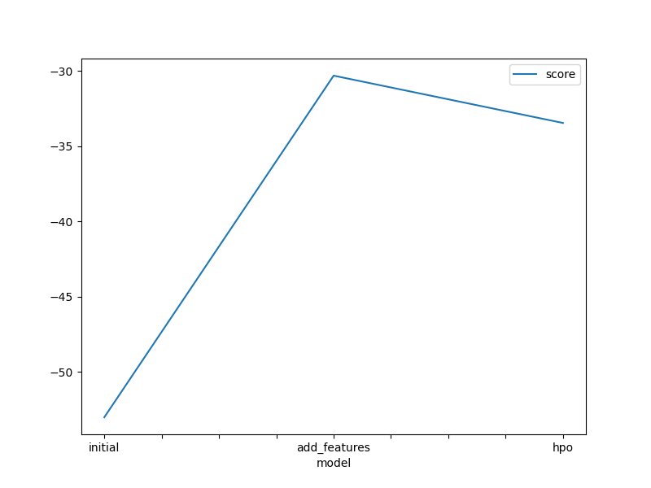
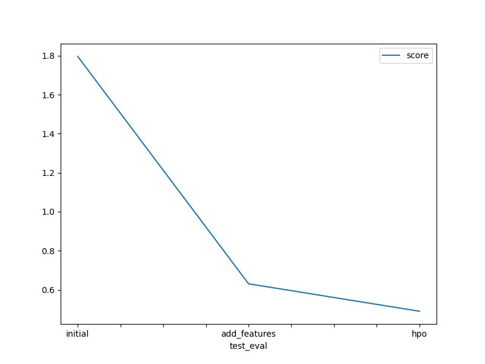
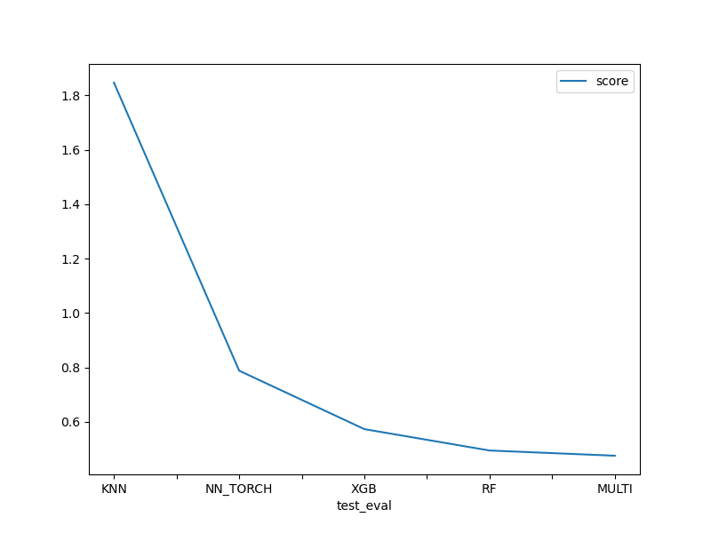

# Report: Predict Bike Sharing Demand with AutoGluon Solution
#### 
Oluwaseun Ale-Alaba

## Initial Training
### What did you realize when you tried to submit your predictions? What changes were needed to the output of the predictor to submit your results?
Nothing really. I believe the submissions were intended to be rejected because they contained negative values. However, my initial predictions didn't include any negative values. Later submissions did have negative values, but I corrected them by replacing them with zeros.

### What was the top ranked model that performed?
The top ranked model that performed was: WeightedEnsemble_L3 with a RMSE of 53.024226

## Exploratory data analysis and feature creation
### What did the exploratory analysis find and how did you add additional features?

Exploratory data analysis process:
- Converted the datetime column to datetime type as it was originally an object type.

- Converted the weather and season columns to category type as they were originally type Int64.

- Noticed that the "holiday" and "workingday" features are of integer type, but represented binary categories; But since they represent binary  categories it was unnecessary to convert them to category type, as the model can extract concrete meaning even though they are of type Int64,  but in the case of multi categories, the model may fail to determine the relationships between categories.

- Created new columns/features by extracting hour, day, and month data from the datetime column.

- Continued exploratory data analysis by:
    - Creating new features for morning, afternoon, and evening categories from the hour column.
    - Creating a feature to categorize hot/cold/mild temperatures from the atemp column.
    - Creating a feature to categorize very windy/mild wind from the windspeed column.
    - Creating a feature to categorize very humid/not humid from the humidity column.
    - Converted each new feature to their respective data type for further analysis.

### How much better did your model preform after adding additional features and why do you think that is?
It performed much better. My kaggle evaluation score decreased from 1.79607 to 0.63052 . Adding more features helped the model to capture more complex relationships within the data.

## Hyper parameter tuning
### How much better did your model preform after trying different hyper parameters?
My Kaggle evaluation score decreased to 0.48994, representing a decrease of over 20% from the previous score of 0.63052 .

### If you were given more time with this dataset, where do you think you would spend more time?
I would spend more time in feature engineering of the dataset.

### Create a table with the models you ran, the hyperparameters modified, and the kaggle score.

| Model        | hpo1          | hpo1            | hpo3    | score   |
|--------------|---------------|-----------------|---------|---------|
| initial      | default       | default         | default | 1.79607 |
| add_features | default       | default         | default | 0.63052 |
| hpo          | learning_rate | num_boost_round | depth   | 0.48994 |

### Create a line plot showing the top model score for the three (or more) training runs during the project.

### Create a line plot showing the top kaggle score for the three (or more) prediction submissions during the project.

### Line plot showing the kaggle score when KNN, XGB, NN_TORCH, RF, and MULTI models were trained

## Summary
For a model to perform well a good amount of work has to be placed into feature engineering and understanding of the data. from the evaluation score gotten from kaggle, the model performance increased when more features were added, and it further increased when hyperparameter tuning was carried out.
for the individual models trained; KNN is a simple model that may not be able to capture complexity in high dimensional data, that is why it had the poorest result. for NN_TORCH, neural networks typically require large amount of data and time to see good results, XGB and RF performed the best because they can produce good results with less computational resources and data compared to NN_TORCH, but then there is a certain level in which the results plateaus, but neural networks will still be able to give better results. 
